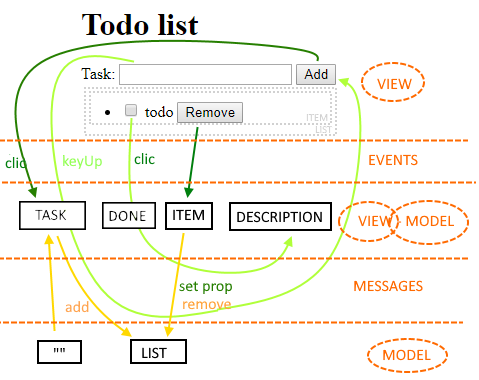
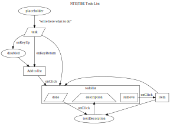

# NTE
## Natural Template Engine

An interesting idea emerged while was developing a todo list app ([Demo](https://zonafets.github.io/NTE/src/TodoListExample/todoapp.html)) to train myself to a deep use of javascript.

**I've done this because many frameworks claim that layout and behavior have to stay separated but infuse the html with more attributes.**

**Googling** with **"@framework simple todolist"** I found this:

- Simple todolist example with AngularJS [code&demo](http://embed.plnkr.co/ZiVJbCeX4GDgC1kMjnUB/)
- Simple todolist example with KnockoutJS [code&demo](http://jsfiddle.net/icoxfog417/sujqa/)
- Simple (not to find) todolist example with React [code](https://github.com/christiannwamba/scotch-react-todo/blob/master/src/index.jsx) [demo](https://codepen.io/codebeast/full/PzVyRm)
- Simple todolist example with AngularJS [code&demo](http://embed.plnkr.co/ZiVJbCeX4GDgC1kMjnUB/)

## NTE code example

Why **natural**? Because the developer must develop using what he already knows by learning new things along the way. So, isn't you that learn the framework, but is the framework that teach to you.

### Goal (more or less)


### index.html

```html
<head>
  <script src="nte.js"></script>
</head>

<body>
    
  <TodoListWidget></TodoListWidget>

</body>
```

**<u>NTE load and convert the following files.</u>**

### TodoListWidget.nhtml (optional)

Will be preprocessed by server into TodoListWidget.html.

```js
h1 "Todo list" 

Task:
  input @Task 
  button "Add to list" @add

ul @TodoList

  li @TodoItem

    checkbox @done 
    @description "todo"
    button "Remove" @remove
```

### **TodoListWidget**.html

```html
<H1>Todo list</H1>

Task:
  <input id="Task"> 
  <button id="Add">Add to list</button>

<ul id="TodoList">

  <li name="TodoItem">
    <input id="Done" type="checkbox">
    <span id="Description">todo</span>
    <Button id="Remove">Remove</button>
  </li>

</ul>
```

### TodoListWidget.njs 
```javascript
Task: '',

Add: (Task,onKeyUp) => 
  this.Enabled = (Task == '')

TodoItem: {
  Description: {
    class: (Done) => Done?"removed":""
    }
},
	
TodoList: {
  remove: (Remove,TodoItem) => 
    TodoItem.Done == false,
  add: (Add,TodoItem,TodoList) => 
    TodoList.push(TodoItem),
}
```

#### TodoListWidget.js explained
```javascript
/* 
wrapped by NTE with:
  var TodoListWidget = {
*/

/* 
init the values
*/

Task: '',

/* 
'this' point to the control
'onKeyUp' link the relative
event of Task to this function 
*/
   
Add: (Task,onKeyUp) => 
  this.Enabled = (Task == '')

TodoItem: {
  Description: {
  
    /* 
    on change of Done, change
    the style of 'Description' 
    */
    
    class: (Done) => Done?"removed":""
    }
},
	
TodoList: {

  /* 
  on change (click) of Remove or Add,
  call relatives functions, with relative
  models 
  */

  remove: (Remove,TodoItem) => 
    TodoItem.Done == false,
  add: (Add,TodoItem,TodoList) => 
    TodoList.push(TodoItem),
}
```

**Advantages**

- semantic check by javascript compiler itself (eg. __wrong parameter name__ with "use strict") but also by NTE ( eg. __tag/control {0} not found in tag {1}__ )
- UI events are hidden/replaced by application actions, that are more similar to messages
- simplify/automate tests 
- simplified diffs (**todo**)

### Ideas for the future

#### Direct link to GUI parts?

I'm imagining some feature as **"hash"** member to automatically connect the URL to a page/tab or component.

#### Easy diagram generation? (using [graphviz](https://github.com/zonafets/NTE/blob/master/src/TodoListExample/todoapp.gv))



#### Widgets template?

```html

money @toPay "To pay"
money @Payed "Payed"

...

<widget name="money" ifParent="form" ifUI="BT3">

  <div class="form-group">
    <label for="@id">@contentText</label>
    <input type="text" class="form-control" id="@id">
  </div>
  
</widget>
```