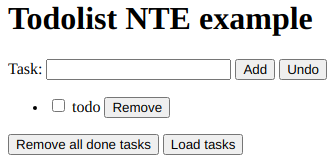

# NTE
## Natural Web Template Engine

Today there are more than 20 frameworks. Each one with pros/cons.

There are also pros/cons of use and not use they.

So I struggled (and I'm struggling) to do something that combine the UNIX philosophy, the concept behind styles, functional programming, mind limits and the KISS principle and the  Kernighan & Plaugher principle: "Don't write comments, rewirte the code".

## NTE code example

**"Natural"** because we must develop using what we already know, learning new things along the way. The framework has to teach while we use it.

### TodoList (view)

```ruby
  H1 "Todolist NTE example"
  Task: input @task
    	button "Add" @add @undo
    ul @list
      li @item
        checkbox @done
        span "todo" @description
        button "Remove" @remove
    button "Remove all done tasks" @removeDones
    button "Load tasks" @loadtasks
```
More below the rendered code as **HTML**.


### TodoList (model)
This is a JSON with js arrow functions, without commas.

```javascript
// data

loadlist:["task1","task2","task3"]
undolist:[]
task: ""
list: []

/* actions
   action_name: (
     model_data_member, ...,
     |ctrl_event, ...,
     |event_precondition,
     |data_precondition
   ) => {
     body
     return (next_model_state)
   }
*/

// ------------------------------
addTask: (
// ------------------------------
  task, 
  list,
  add_click,
  task_keypress_keyCode_13,
  task_isnot_empty
  => {
     list.push({
       done:false, 
       description:task
       })

     return {task:""}
     } 

// ------------------------------
undoTask: (
// ------------------------------
  list, 
  undolist,
  undolist_count_isnot_0
  ) 
  => {
     list.push(undolist.pop())
     }

// ------------------------------
loadtasks: (
// ------------------------------    
  // onclick implicit
  loadlist,
  list)
  => {
    for (i in loadlist)
      list.push(
        {done:false,
         description:loadlist[i]
        }
      )
  }

// ------------------------------
removeTask: (
// ------------------------------    
  list, 
  item,
  remove_click)
  => list.pop(item)

// ------------------------------
removeDones: (
// ------------------------------    
  list,
  item,
  done_is_true
  )
  // implicits:
  // - removeDones_click
  // - for each item in list
  //   where item.done===true
  //   do:
  => list.pop(item)

// controls behaviours

// ------------------------------
add: { 
// ------------------------------    
  disabled: 
    (task,task_keypress)
    => task==="" 
  }

// ------------------------------
undo: {
// ------------------------------    
  disabled:
    (list)=>list.count===0 
    // object's change events
    // come from  
    // method's override
}

// ------------------------------
list: {
// ------------------------------    
  item: {
    description: {
      className: 
        (done) => done?"removed":""
        // done_change is implicit
      }
  }
}
```
Will follow the **transpiled** Javascript version.

**Pros**

- auto-bind between controls and model data 
- a lot of inference
- no learning curve but only a y=m*x with very low m
- client or server pre rendering/transpile
- model can be generated by a server IDE/language of your pleasure 
- component oriented
- possible flow-check
- simplify/automate tests 
- simplified code diffs
- possible automatized diagram generation with tools as Graphwiz

**Cons**

- let me know

### TodoList.html

```html
<TodoList>
  <H1>Todolist NTE example</H1>

  Task:
  <input name="task"> 
  <button name="add">Add</button>
  <button name="undo">Undo</button>

  <ul name="list">

    <li name="item">
      <input name="done" type="checkbox">
      <span name="description">todo</span>
      <Button name="remove">Remove</button>
    </li>

  </ul>
  <button name="removedones">Remove all done tasks</button>
  <button name="loadtasks">Load tasks</button>
</TodoList>
```

#### Some proof of concepts

**Get function parameters**

```javascript
var STRIP_COMMENTS = /((\/\/.*$)|(\/\*[\s\S]*?\*\/))/mg;
var ARGUMENT_NAMES = /([^\s,]+)/g;
function getParamNames(func) {
  var fnStr = func.toString().replace(STRIP_COMMENTS, '');
  var result = fnStr.slice(fnStr.indexOf('(')+1, fnStr.indexOf(')')).match(ARGUMENT_NAMES);
  if(result === null)
     result = [];
  return result;
}

var test1 = function(a,b,c,d) {var a=10}
var test2 = function() { return (aa,bb)=>{arg1:"val1"} }()

console.log(getParamNames(test1))
console.log(getParamNames(test2))
console.log(test2)
```

**Arrow functions**
```javascript
var list = []
var undolist = ["hi"]
list.push("hello","ciao")
console.log(list)
var model = {
    fn: (list,push) => ({a:1,b:2}),
    fnfn: (undolist,pop) => (list,push) => {},
    test: (task) => task === "",
    listpop: list => list.pop(),
    listlist: list => {for (i in list) console.log(list[i])},
    undo: (list,undolist) => {list.push(undolist.pop());return "ok"},
    simple: (list,list_count_0)=>{}
}
model.listlist(list)
console.log(model.test(""))
console.log(model.listpop(list,"ciao"))
console.log(model.list)
console.log(model.undo(list,undolist))
model.simple(list,0)
```

### Ideas for the future

#### Widgets template and/or 3rd party component binding

```javascript
money @toPay "To pay"
money @Payed "Payed"
...
widget @money
       ?parent = "form"
       ?UI = "BT3"
  div .form-group
    label !for=@@id
          @@content
    input @@id
          !type="text"
          .form-control
```

#### Rendered HTML
```html
<widget name="money" 
        ifParent="form" 
        ifUI="BT3">

  <div class="form-group">
    <label for="@id">
      @content
    </label>
    <input id="@id"
           type="text"
           class="form-control" >
  </div>
  
</widget>
```

### TODO examples with other frameworks
**Googling** with **"@framework simple todolist"** I found this:

- Simple todolist example with AngularJS [code&demo](http://embed.plnkr.co/ZiVJbCeX4GDgC1kMjnUB/)
- Simple todolist example with KnockoutJS [code&demo](http://jsfiddle.net/icoxfog417/sujqa/)
- Simple todolist example with React [code](https://github.com/christiannwamba/scotch-react-todo/blob/master/src/index.jsx) [demo](https://codepen.io/codebeast/full/PzVyRm)
- Simple todolist example with Angular2 [code&demo](http://embed.plnkr.co/ZiVJbCeX4GDgC1kMjnUB/)

### Next cases to check

* case y = m * x
* editable grid
* grid with sub grid
* grid with filters and resulting expression

## **Case y = m * x**


#### ymx.html.nte
```javascript
@@anonymouse = "input"
@@before = "@@id:"

@y = @m * @x
```
#### ymx.html
```html
y:<input id="y"> = m:<input id="m"> * x:<input id="x">
```
#### ymx.js.nte
```javascript
var ymx = {
    x:0, y:0, z:0, 

    y:(x,m)=>return x*m,
    x:(y,m)=>return y/m,
    m:(y,x)=>return y/x,
}
```
