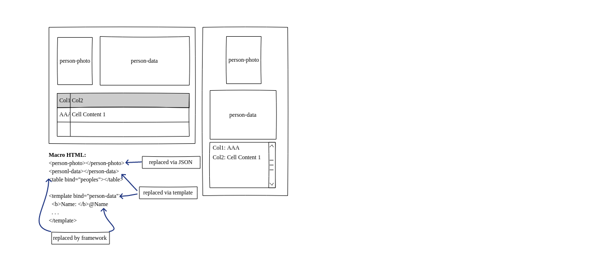
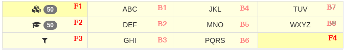

# Natural template engine
###### (Under brain storming)

**Like** many of us, I asked myself these amletic questions:

- mix js with html or keep them separated?
- JSON or X(A)ML?
- what, when where render in which side?

I am looking for a single answer, without inventing in a new language or deviating excessively from the common way.

**Eventually avoid test code through generated code.**

Here is the classic "hello world" sample.


```html
<input id="name" label="Name:">
<p>Hello @name!</p>
```
In the client or from server, the functions **input(node)** and **p(...)** will replace the above with:
```html
<label for="name">Name:</label>
<input id="name" onchange="NTE.notify('@name',this)">
<p>Hello <span name="@name"></span>!</p>

<script> ... </script>
```

** But what about somethin more complex? **
```html
<child></child>
```

the above must eventually result in:

```html
<label>Child name:
	<input id="person.child.fname">
	<input id="person.child.lname">
</label>
<label>father name:
	<input id="person.father.fname">
	<input id="person.father.lname">
</label>
<label>mother name:
	<input id="person.mother.fname">
	<input id="person.mother.lname">
</label>
<script>
	// every event link and data check
</script>
```

because previously we defined:
```html
<component id="person" data-source="person">
	<label>@label
		<input id="fname">
		<input id="lname">
	</label>
</component>

<component id="child" inherit="person" data-source="childs" label="Child name">
	<person id="father" data-source="fathers" label="@id name"></person>
	<person id="mother" data-source="mothers" label="@id name"></person>
</component>
```

**This "middle" code is more complex than the preiovious** and write a new framework is hard. 

##### A more chic example (I'm playing with imagination)

```html
<widget tag="input" parent="form" type="text">
	<!-- bootstrap wrapper -->
	<div class="form-group">
		<label class="control-label @Cols.Label">
			%label
		</label>
		<div class="@Cols.Input">
			<input id="%id" class=...>
		</div>
	</div>
</widget>

<form vm="app">
	<input label="First Name" id="fname">
	<input label="Last Name" id="lname">
	<p>Hello @fullname!</p>
	<input label="birthday" id="date" type="date">
	<p>age:<age></age></p>
<form>

<script>
	var app = {
		fname:"", lname:"", birthday:"",
		fullname: function(fname,lname) {
			...
		}
		age: function() { this.innerText = ... }
	}
</script>
```
##### And what about webasm.
```html
<script type="C#">...</script>
<script type="SQL">...</script>
```

##### A little digression

Consider these:
```
	// changeView is a event handler, used also as function
	
	changeView()			// means check status and set view state
	
	body.class = "fade-in"	// means show
	...
	changeView(null,0)		// means check and set it immediatelly
```

##### An example of possible replacements with trans-formations


##### I'll examine the briefest way to render a pad, similar to smartphone keyboard.


After more than fifteen years developing application with various languages on different platforms, I came to the web applications.

My real experience was with html, javascript, jquery, bootstrap and knockout but I took a look to Angular, Vue, React and web components.

**Is the the war of frameworks and we are soldiers that die for the generals' foibles**

_What I found in everyone is a loss of naturalness of the basic html and javascript languages._

What's interesting is that instead of hiring 10 javascript monkey programmers (I'm one of them), companies hire 10 expert (programmers?) in 10 different frameworks.

I admit that MVVC is brilliant and convenient for testing logic. But even MVC was.

From N framework there were just as many for the tests. But do you test the code or the logic?

React claim to be better than others.

After a few years each framework reaches its limit (or the limit of human experience?)

**What's the middle way?**

With MSAccess, we define a table and its relationships. With a click on one of the wizards, we generate his representation. Then we move the controls and complete with code attached to the events. 
In one day we do the work of one week. The generated code is already tested at 80%.

Each time we can improve quality of the structure and the design. 

The BeforeUpdate trigger/event can split data into normalized tables. We can defer the operation to improve performance. 

The AfterUpdate trigger/event can clone data into backup server.

This triggers combined can transform MSAccess in a ORM for MongoDB without rewrite the whole application in Angular with RESTfull API.

Unfortunatelly MS means Microsoft that means closed source that means closed mind.

Unfortunately MS means Microsoft that means closed source that means closed mind. But open source not necessarily means open mind.

Personally I used too a table from the same database to keep the change log. I could have exported it in the ticket system (if this "complete system" had admitted this function) or VCS.

**This is my (work-in-progress) brainstorming about something to KISS and RKB (Keep It Simple and Stupid and Recycle Knowledge Base).**

## Examples of different templates of the frameworks

### Knockout template
```html
<div data-bind="template: { name: 'person-template', foreach: people }"></div>
 
<script type="text/html" id="person-template">
    <h3 data-bind="text: name"></h3>
    <p>Credits: <span data-bind="text: credits"></span></p>
</script>
```

### JQuery tmpl
```html
<script type="text/html" id="peopleList">
    {{each people}}
        <p>
            <b>${name}</b> is ${age} years old
        </p>
    {{/each}}
</script>
```

### Underscore template engine
```html
<script type="text/html" id="peopleList">
    <% _.each(people(), function(person) { %>
        <li>
            <b><%= person.name %></b> is <%= person.age %> years old
        </li>
    <% }) %>
</script>
```

### Angular template
```typescript
import { Component } from '@angular/core';

@Component ({
   selector: 'my-app',
   template: `<h1>Hello {{name}}</h1>`,
})
export class AppComponent  { name = 'Angular'; }
```

## Some Hello World! examples

### Pure HTML(5)/Javascript (1)

```html
Name: <input id="name" type="text" value="World"/>
<p>Hello <span id="msg"></span>!</p>
<script>
	// "" not triggered on value=...
	name.addEventListener("change",function(){
		msg.innerText = this.value;
	});
</script>

```

### Pure  HTML(5)/Javascript (2)

```html
Name: <input type="text" id="input"> 
Hello: <span id="result"></span>!
<script>
  input.oninput = function() {
    result.innerHTML = input.value;
  };
</script>
```


### JQuery
```html
Name: <input id="name" type="text" value="World"/>
<p>Hello <span id="msg"></span>!</p>
<script>
	// !! not triggered on value=...
	$("#name").change(function() {
		$("#msg").text($(this).val());
	});
</script>
```

### KnockoutJS

```html
<p>Name: <input data-bind="value: Name" /></p>
<p>Hello, <span data-bind="text: Name"> </span>!</p>
<script>
	var ViewModel = function(name) {
	    this.Name = ko.observable(name);
	};
 
	ko.applyBindings(new ViewModel("World"));
</script>
```

### VueJS

```html
<div id="app-6">
  Name:<input v-model="name">
  Hello <p>{{ name }}</p>!
</div>
<script>
var app6 = new Vue({
  el: '#app-6',
  data: {
    name: 'World'
  }
})
</script>
```

### AngularJS
```html
Name:<input type='text' ng-model= "Name"><br>

Message:<p>Hello {{Name}}!</p>
```

### React 
(one of many versions I found)
```javascript
var createReactClass = require('create-react-class');

var WithLink = createReactClass({
  mixins: [LinkedStateMixin],
  getInitialState: function() {
    return {message: 'Hello!'};
  },
  render: function() {
    return <input type="text" valueLink={this.linkState('message')} />;
  }
});
```

**But as I know that "the name of the thing isn't the thing", I suppose that Gödel's incompleteness theorems are valid to any language.**

So what I would like is think to a template engine that at least keep the nature of the language, hiding the complex parts, generating hidden code.

---------------------
## Goals
* **recycle** common (and free) editors with basic features about auto completition, syntax check and highlight
* **recycle** simple and common xml/html parsers
* **or** use browser's parse as lib/helper for server
* make simple build a plugin for auto completition
* make simple double bind IDE and code 
* two side rendering (client and/or server side)
  e.g.: from C# to Javascript or from Javascript to C# 
* **two way rendering**
  e.g.: 
  	&lt;script side="both" type="text/c#" ... &gt;
        &lt;input side="server" link = ... &gt;

### Expression case (simplified)
(without validation/Error management)
```html
<input id="x" label="X:" link="changes">
<input id="m" label="M:" link="changes">
<input id="y" label="Y:" link="changes">

<script>
// "change" listeners will be automatically added to x, m, y

function changes(ev)
{
	var sended=this;
	if (sender.id=="x") y = m * x;
	if (sender.id=="y") x = y / m;
	if (sender.id=="m") {
		if (x!=null) 
			y = m * x;
		else {
			if (y!=null) 
				x = y / m; 
		}
	}
}

</script>

```


### Expression case study in Knockout
See [complete code](./src/ko_ymx_expression_test.html) in [action](https://rawgit.com/zonafets/NTE/master/src/ko_ymx_expression_test.html).

```html
<h2> KO ymx expression test </h2>

<p>
x:<input data-bind="value:x"><br>
m:<input data-bind="value:m, event:{blur:updatem}"><br>
y:<input data-bind="value:y, enable: !mNaN()"><br>
</p>

<p>
first name:<input data-bind="value:fname"><br>
last name:<input data-bind="value:lname"><br>
full name:<input data-bind="value:fullname"><br>
</p>

<p>Initial value of viewmodel updates inputs, but must be done after subscription.</p>
<p>Note the use of blur event to force updates and recalc.</p>

<p>The code shows as the MVVM pattern link members without force to give a name to the actions.
When X is modified, y is calculated. But the calculus has a name: "line".
Is this part of lost controller?
</p>

<script>
	// I forgot this piece of code that do not give any error
	$("#name").change(function() { $("#msg").text($(this).val()) });

	var vm = new function() {

		var me = this

		/** properties **/
				
		me.x = ko.observable()
		me.m = ko.observable().extend({ notify: 'always' });
		me.y = ko.observable()
		
		me.fname = ko.observable()
		me.lname = ko.observable()
		me.fullname = ko.computed(function(){ return me.fname()+" "+me.lname() })
		
		/** private **/
		
		var x = me.x
		var y = me.y
		var m = me.m
		
		function xNaN() { return isNaN( x() || 'a' ) }
		function yNaN() { return isNaN( y() || 'a' ) }
		function mNaN() { return isNaN( m() || 'a' ) }
		
		/** public **/
				
		me.mNaN = mNaN; // required by <input> of y 
		
		me.updatem = function() { m(m()) }
		
		x.subscribe( function() {
			if (!xNaN() && !mNaN()) 
				y( m() * x() );
		})
		
		m.subscribe( function() {
			if (!xNaN()) y( m() * x() );
			if (!yNaN()) x( y() / m() );
		})
		
		y.subscribe( function() {
			if (!yNaN() && !mNaN()) 
				x( y() / m() );
		})
		
		/** init here ensure call of subscribers **/
		
		x(3);
		m(1);
		
	} // vm
	
	ko.applyBindings(vm);	

</script>
```

### Expression case study with NTE
* See [complete code](./src/nte_ymx_expression_test_l1.html) in [action](https://rawgit.com/zonafets/NTE/master/src/nte_ymx_expression_test_l1.html) and [transpiled](https://rawgit.com/zonafets/NTE/master/src/nte_ymx_expression_test.js) (layer 1)

* See [complete code](./src/nte_ymx_expression_test_l2.html) in [action](https://rawgit.com/zonafets/NTE/master/src/nte_ymx_expression_test_l2.html) and [transpiled](https://rawgit.com/zonafets/NTE/master/src/nte_ymx_expression_test.js) (layer 2).

##### Sample 1

```html
<h2> NTE ymx expression test</h2>

<!-- sample 1 -->
x: <input id="x" link="calc" require="#x,#m"> <br>
m: <input id="m" link="calc" require="#m,(#y|#x)" update="change,blur" default="1"> <br>
y: <input id="y" link="calc" require="#y,#m" enableIf="m" debug="link"> <br> <br>

<script>

	var app = new function() {
		
		var me = this;
				
		/** properties **/
		
		me.x = 3
		
		/** private **/
		
		function xNaN() { return isNaN( me.x || 'a' ) }
		function yNaN() { return isNaN( me.y || 'a' ) }
		
		/** public **/
		
		me.calc = function () {
			var line = true;
			var reverse = false;
			switch (this.id) {
			case "m":
				if (xNaN() && !yNaN()) {
					line = false
					reverse = true
					}
				break;
			case "y":
				line = false;
				reverse = true;
				break;
			}
			if (line) me.y = me.m * me.x;
			if (reverse) me.x = me.y / me.m;
		}
		
	}
	
</script>
```

##### Sample 1: ready to scale

```html
<h2> NTE ymx expression test</h2>

<!-- sample 1: scaled -->
x: <input id="x" link="line,y" require="#x,#m"> <br>
m: <input id="m" link="line_or_reverse,y,x" require="#m,(#y|#x)" update="change,blur" default="1"> <br>
y: <input id="y" link="reverse_line,x" require="#y,#m" enableIf="m" debug="link"> <br> <br>

<script>

	var app = new function() {
		
		var me = this;
				
		/** properties **/
		
		me.x = 3
		
		/** private **/
		
		function xNaN() { return isNaN( me.x || 'a' ) }
		function yNaN() { return isNaN( me.y || 'a' ) }
		
		/** public **/
	
		me.line = function () { me.y = me.x * me.m }
	
		me.line_or_reverse = function() {
			if (!xNaN()) 
				me.y = me.m * me.x;
			else {
				if (!yNaN()) me.x = me.y / me.m;
			}
		}
		
		me.reverse_line = function() { me.x = me.y / me.m }
				
	}
	
</script>
```

##### Sample 2

```html
<h2>NTE ymx expression test</h2>

<!-- sample 2 -->
first name: <input id="fName" link="fullName"> <br>
last name: <input id="lName" link="fullName"> <br>
full name: <input id="fullName" enableIf="fname,lname" readonly> <br> <br>

<!-- sample 2: alternative -->
first name: <input id="fName"> <br>
last name: <input id="lName"> <br>
full name: <input id="fullName" required="fName,lName" readonly> <br> <br>

<script>

	var app = new function() {
		
		var me = this;
		
		me.fullName = function() { return me.fName + " " + me.lName }
		
	}
	
</script>
```

## Performance
**Difficult to think of performance in a variable context** where the client can be more powerfull than server or the connections can be slow or too much.

The server can do more to make the client faster. But this grows traffic. And today's optimized browser can create DOM elements faster than yesterday. But today binary DOM can be transmitted faster. So as ORM is simpler than SQL even if more similar to older DBF, it is slower than SQL because wraps it. But SQL is slower than DBF (we see compilation of SELECT x+y for the first time only in the 2018). Anyway noSQL borns because speed depend on how data is joined and not how is stored. But, again, even the distribution/replication/caching of data increase the traffic outside and inside. **Is it the uncertainty principle of Heisemberg?**

Certainly being able to distribute is useful. I've seen this 1st time in the 1997 between Oracle and Personal Oracle.

** And what about webASM?**. The performance superiority of simplified VMs has already been demonstrated with Emscripten. A simulated VM under js VM is faster and produces less bugs than javascript code.

The last is amazing and terrificant at same time.

### Pad 


- F1, F2, F3: have fixed content
- F1,F2: are mutually exclusive
- B1-B8: are mutually exclusive
- F3: change view of B1-B8
- F4: enable/disable filter selected with F3

After two or three revisions, this code split functionality between KO inline data-bind, subscriptions and some trick old style and JQuery magic.

** What I'll like is(utopically) keep all into HTML **.

#### Initial code
This is a mixed solution. We can (or have trouble to) decide to move behaviour between inline html expressions or leave it in the code. The HTML cannot be splitted and optimized how javascript.
```html
<!-- ko with:PadFilter -->
<div class="row students-filter" data-bind="click: EventHandler, visible:Alpha">

    <div class="col-xs-3">

    	<div class="col-sm-4" 
    	     id="Primary" title="filter by primary school"
             data-bind="css:{'filter-selected':Level() == SchoolInfoType.Primary}">
    		<i class="fa fa-cubes"></i>
    		<span class="badge" data-bind="text:NumOfPS"></span>
    	</div>
    	<div class="col-sm-4" 
    	     id="Secondary" title="filter by secondary school"
             data-bind="css:{'filter-selected':Level() == SchoolInfoType.Secondary}">
    		<i class="fa fa-graduation-cap"></i>
    		<span class="badge" data-bind="text:NumOfSS"></span>
    	</div>
        <!-- ko if: FilterByAttendanceEnabled -->
    	<div class="col-sm-4" 
    	     id="Type" title="filter by attendance type">
    		<i class="fa fa-filter"></i>
    	</div>
        <!-- /ko -->
        <!-- ko ifnot: FilterByAttendanceEnabled -->
        <div class="col-sm-4">
            &nbsp;
        </div>
        <!-- /ko -->

    </div>
    
    <div class="col-xs-3">

    	<div class="col-sm-4" id="T1" data-t9="ABC" data-flt="1">
            <!-- ko if: Alpha -->
            ABC
            <!-- /ko -->
            <!-- ko ifnot: Alpha -->
            <i class="fa fa-cutlery"></i>
            <!-- /ko -->            
        </div>
    	<div class="col-sm-4" id="T2" data-t9="DEF" data-flt="2">DEF</div>
    	<div class="col-sm-4" id="T3" data-t9="GHI" data-flt="3">GHI</div>

    </div>

    <div class="col-xs-3">

    	<div class="col-sm-4" id="T4" data-t9="JKL" data-flt="4">JKL</div>
    	<div class="col-sm-4" id="T5" data-t9="MNO" data-flt="5">MNO</div>
    	<div class="col-sm-4" id="T6" data-t9="PQRS" data-flt="6">PQRS</div>

    </div>

    <div class="col-xs-3">

    	<div class="col-sm-4" id="T7" data-t9="TUV" data-flt="7">TUV</div>
    	<div class="col-sm-4" id="T8" data-t9="WXYZ" data-flt="8">WXYZ</div>
    	<div id="AttendanceType" class="col-sm-4" style="background:#ffffb0" title="select attendance type">
            &nbsp;
    	</div>

    </div>

</div> <!-- view of alpha keyb. layout -->

<div class="row students-filter" data-bind="click: EventHandler, visible:!Alpha">
    TODO: Service filters
</div>
<!-- /ko -->

<script>
    ...

    vm.PadFilter.T9.subscribe( ()=>{vm.filterStudents()} )
    vm.PadFilter.Level.subscribe( ()=>{vm.filterStudents()} )
    
    @* -------------------------------------------------------------------------- *@

    /// called on press of a button of filter pad 
    vm.PadFilter.EventHandler = function (data,ev)
    {
    	var ff = this;
        var node = ev.target;
    	
    	if (node.id == "")
            node = ev.target.parentElement

        var id = node.id

        switch (id) {
        case 'Primary':
            ff.Level(SchoolInfoType.Primary)
            return
        case 'Secondary':
            ff.Level(SchoolInfoType.Secondary)
            return
        case 'Type':
            ff.Alpha(!ff.Alpha())
            return
        case 'AttendanceType':
            return
        default:
            if (id == "") return
            if (ff.Alpha()) {
                var fndBtn = (val) => {return $("[data-t9='"+val+"'")}
                var oldBtn = fndBtn(ff.T9())
                var newBtn = fndBtn(node.dataset["t9"])
                oldBtn.toggleClass('filter-selected')
                if (oldBtn.is(newBtn)) {
                    ff.T9("")
                    return
                }
                newBtn.toggleClass('filter-selected')
                ff.T9(node.dataset["t9"])
            }
        }
    }
    
    ...
</script>
```

#### Ideal solution (work in progress)

```html
<filter-pad>
	<col>
		<primary></primary>
		<secondary></secondary>
		<type></type>
	</col>
	<type-alpha>
		<col>
			<btn> ABC </btn>
			<btn> DEF </btn>
			<btn> GHI </btn>
		</col>
		<col>
			...
		</col>
	</type-alpha>
	<type-service>
		...
	</type-service>
</filter-pad>
```

### Common Element Definition
Looking at https://developer.mozilla.org/en-US/docs/Web/HTML/Element/input/checkbox, I try to define a base structure that act as base template to model the code to generate.
```javascript
	checkbox: {
		defaultValue: false,	// data type
		events:["change","input"],
		commonAttributes:["checked"],
		IDLAttributes:["checked","value"]
		methods:["select"]
	},
	radio: {
		inherits: "checkbox"
	}
```

### Todolist case
```html
Todo:<input id="new" link="add,todos">
<table>
<tbody>
	<tr items="todos" as="item">
		<td><span style="item.style">@item.todo</span></td>
		<td><input value="item.done" type="checkbox"></td>
		<td><button id="delete">delete</button></td>
	</tr>
	</each>
</tbody>
</table>

<script>
	var todos = []

	function TodoItem(todo,done) {
		return {
			todo:todo,
			done:done||false,
			style:function() {
				if (this.done) 
					return "text-decoration-line: line-through"
			}
		}
	}
	
	function add() {
		todos.push(new TodoItem(this.value))
	}

</script>
```

#### A possible shortest way for a TotoList(?)
```html
Todo:<input id="todos.todo">
<table id="todos"></table>

<script>
var todos = [];
var todosTemplate = {

	dataModel: {
		id: -1,
		todo: "",
		done: false,
		remove: function() {...},
		},
		
	css: "todolist-table",
	
	viewModel: {
		thead: { ... },
		todo: "",
		done: "checkbox",
		remove: "button",
		},
		
	onUpdate:function(item) {
		...
		var todoTD = item.$tr.children(0)[0];
		$( todoTD ).toggleClass("strike",item.done)

	};

}
</script>

```

### Example of widget template and use

```html
<template id="inputBox">

	<params>
		<update> type of update
			<value name="onKeyup">fired on single key released</value>
			<default name="onChange">fired after RETURN or exit</default>
		</update>
		<caption>optional label</caption>
	</params>
	
	<widget>
		<label>@caption</label>
		<input id="@id" type="text"/>
	</widget>

	<script>
	
		function $$inputBox(node)
		{
			var link = node.attributes.link;
			...
		}

	</script>
	
</template>

<app>
	<inputBox me="name" caption="Name" update="keyup" value="World"></inputBox>
</app>


```

### Possible widget init/update (?)


```javascript
function app.$inputBox(element,value,update,caption)
{
	// ...
}
```


### Example of attribute to control the view&flow

```html
<app>

	<script>
		var app={
			count:0,
			range:[],
			count$change = function() {
			// fill range with random 1..count
			}
		}
	</script>
	
	Show: <input id="show" type="checkbox">
	
	Enable: <input id="enable" type="checkbox">
	
	Count: <input id="count" visibleIf="show" enableIf="enable"/>
	
	<table if="count"> <!-- render if not null -->
		<tbody>
			<tr each="range" as="item" idx="i">
				<td>Value of item <b>@i</b> is "<b>@item</b>"</td>
			</tr>
		</tbody>
	</table>

</app>
```

### Es. client/server mixed rendering with complex management
**Rules**

- "innerText" is equal to "value"


```html
<config ui="bootstrap">
	<!-- this will be rendered from server as
	<script src = "...">
	--> 
</config>

<app>

	<template id="td-input">
		<widget>
			<td>
				<input id="@id" value="@value"/>
			</td>
		</widget>
	</template>

	<!-- this will be captured by a method of server called dataTable(...) -->
	<data-table name="students">
		<source>
			select id,name 
			from students;
		</source>
	</data-table>
	
	<!-- and rendered as -->
	<script>
		app.students = $.getJSON("/students", app.$students$change);
		<!-- with relative service -->
	</script>

	<!-- master -->
	<table class="table table-striped">
		<thead>
			<tr>
				<th>Id</th>
				<th>Name</th>
				<th>Name</th>
				<th>Actions</th>
			</tr>
		</thead>
		<tbody>
			<tr each="students" as="student">
				<td>@student.id</td>
				<td-input>@student.name</td-input>
				<td click="students$remove"> X </td> 
			</tr>
		</tbody>
	</table>
	
	<!-- details -->
	<table>
		<tr each="lessons" reference="students">
		</tr>
	</table>
	
	<script>
		app.students$remove(index) {
			// remove lessons
			// call ajax(?)
			// above code can be already generated by <data-table> renderer
		}
	</script>
</app>

```

### Tree view case
```html
<script>
	function Node(id,name,children) 
	{
		return new {
			Id:id, Name:name,
			Children: children
	}
		
	var app = 
	{
		Selected:[],
		TreeData:[
			Node(1,"One"),
			Node(2,"Two",[
				Node(3,"Three"),
				Node(4,"Four")
				])
			]
	}
</script>

<template id="checkbox">
	<input id="@id" type="checkbox" click="@click"/>
</template>

<template id="tree">

	<template id="node">
		<li each="@value" as="node">
  			@node.Name<checkbox click="@selected$push(@node.Id)"></checkbox>
		</li>
		<tree selected="@selected">@node.children</tree>
	</template>

	<widget>
		<ul ifLevel="1th" id="@id" class="collapsibleList">
  			<node selected="@selected">@value</node>
		</ul>
		<ul ifLevel="nth">
  			<node selected="@selected">@value</node>
  		</ul>
	</widget>
</template>

<app>
	<tree selected="Selected">@TreeData</tree>
</app>
```

